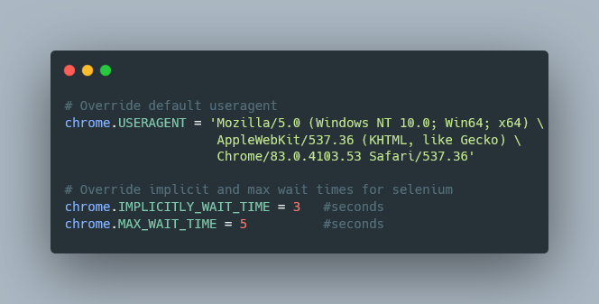

<!--- Heading --->
<div align="center">
  <h1>ak_selenium</h1>
  <p>
    Selenium package with requests integration and anti-bot detection measures
  </p>
<h4>
    <a href="https://github.com/rpakishore/ak_selenium">Documentation</a>
  <span> · </span>
    <a href="https://github.com/rpakishore/ak_selenium/issues/">Report Bug</a>
  <span> · </span>
    <a href="https://github.com/rpakishore/ak_selenium/issues/">Request Feature</a>
  </h4>
</div>
<br />


[](https://github.com/rpakishore/ak_selenium/actions/workflows/test.yml)

<!-- Table of Contents -->
<h2>Table of Contents</h2>

- [1. About the Project](#1-about-the-project)
  - [1.1. Features](#11-features)
- [2. Getting Started](#2-getting-started)
  - [2.1. Dependencies](#21-dependencies)
  - [2.3. Installation](#23-installation)
    - [2.3.1. Production](#231-production)
    - [2.3.2. Development](#232-development)
- [3. Usage](#3-usage)
  - [Additional Options](#additional-options)
- [4. Roadmap](#4-roadmap)
- [5. License](#5-license)
- [6. Contact](#6-contact)
- [7. Acknowledgements](#7-acknowledgements)

<!-- About the Project -->
## 1. About the Project

<!-- Features -->
### 1.1. Features

- Launch Selenium with custom options
- Automatically try to add Chrome UserData
- Add anti-bot detection measures
- Pass selenium headers/cookies to requests library

<!-- Getting Started -->
## 2. Getting Started

### 2.1. Dependencies

Create the virutual environment and install dependencies

```bash
python -m venv .venv

.venv\Scripts\activate.bat

pip install flit
```

<!-- Installation -->
### 2.3. Installation

#### 2.3.1. Production

Install with flit

```bash
  flit install --deps production
```

Alternatively, you can use pip

```bash
pip install ak_selenium
```

#### 2.3.2. Development

Install with flit

```bash
  flit install --pth-file
```

<!-- Usage -->
## 3. Usage

```python
from ak_selenium import Chrome, By, Keys
chrome = Chrome(
    headless=False, # Start Chrome in headless mode
    chrome_userdata_path=r"path\to\user\data", #Defaults to correct location in windows
    half_screen=True, # Set the browser to half the screen size (Only applicable if NOT `headless`)
    )

#Get Chromedriver
driver = chrome.driver

#Get the website
driver.get("https://example.com")

#Wait for elements to load
locator = (By.TAG_NAME, "h1")
chrome.Wait_for_locator(locator)

#Get requests Session
s = chrome.update_req_headers_cookies()
s.get("https://www.iana.org/domains/reserved")

```

### Additional Options


<!-- Roadmap -->
## 4. Roadmap

- [ ] Add beautifulsoup integration
- [ ] Proxy

<!-- License -->
## 5. License

See LICENSE.txt for more information.

<!-- Contact -->
## 6. Contact

Arun Kishore - [@rpakishore](mailto:pypi@rpakishore.co.in)

Project Link: [https://github.com/rpakishore/ak_selenium](https://github.com/rpakishore/ak_selenium)

<!-- Acknowledgments -->
## 7. Acknowledgements

- [Awesome README Template](https://github.com/Louis3797/awesome-readme-template/blob/main/README-WITHOUT-EMOJI.md)
- [Banner Maker](https://banner.godori.dev/)
- [Shields.io](https://shields.io/)
- [Carbon](https://carbon.now.sh/)